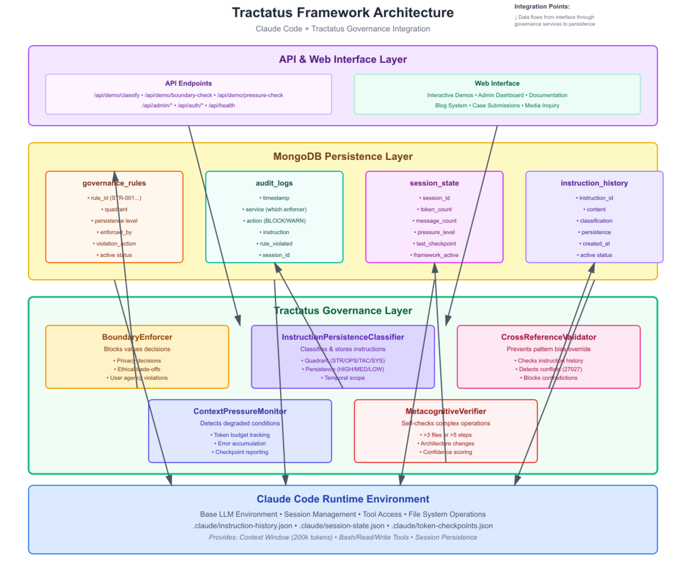

# Technical Architecture

**Last Updated:** October 12, 2025
**Audience:** Technical, Implementer, Researcher
**Quadrant:** SYSTEM
**Persistence:** HIGH

---

## Overview

The Tractatus Framework operates as a governance layer that integrates with Claude Code's runtime environment. This document provides a comprehensive technical architecture diagram and explanation of how the components interact.

## System Architecture

The system is organized into four distinct layers that work together to provide robust AI governance:



### 1. Claude Code Runtime Environment (Foundation Layer)

**Purpose:** Provides the base LLM environment and session management infrastructure

**Components:**
- **Context Window:** 200,000 token budget for conversation and file content
- **Session Management:** Persistent session state tracking and token checkpoints
- **Tool Access:** Bash, Read, Write, Edit, and other file system operations
- **File System:** Dedicated `.claude/` directory for framework state

**Persistent Files:**
- `.claude/instruction-history.json` - Classified instruction database
- `.claude/session-state.json` - Current session tracking
- `.claude/token-checkpoints.json` - Token milestone records

**Key Features:**
- Session continuity across conversation compactions
- Tool access for framework enforcement
- File system operations for governance rules
- Context window management

---

### 2. Tractatus Governance Layer

**Purpose:** Enforces governance rules and prevents AI failure modes

This layer consists of five core services that monitor, classify, validate, and verify AI operations:

#### A. BoundaryEnforcer

**Function:** Blocks values decisions requiring human approval

**Blocks:**
- Privacy policy changes
- Ethical trade-offs
- User agency violations
- Strategic mission changes
- Indigenous rights decisions

**Enforcement:** BLOCK_AND_ESCALATE action when boundary violated

**Integration:** Checks all decisions before execution, escalates to human approval

**Example Use Case:** Prevents AI from autonomously deciding privacy policy changes without explicit human approval

---

#### B. InstructionPersistenceClassifier

**Function:** Classifies and stores all explicit instructions

**Classification Dimensions:**
- **Quadrant:** STRATEGIC, OPERATIONAL, TACTICAL, SYSTEM, STOCHASTIC
- **Persistence Level:** HIGH (session-permanent), MEDIUM (contextual), LOW (transient)
- **Temporal Scope:** permanent, session, task, immediate

**Storage:** Appends to `.claude/instruction-history.json` with metadata

**Integration:** Intercepts all user instructions for classification before execution

**Example Use Case:** User says "Always use MongoDB port 27027" → Classified as SYSTEM/HIGH/session → Stored for validation

---

#### C. CrossReferenceValidator

**Function:** Prevents pattern bias from overriding explicit instructions

**Validation:**
- Queries `.claude/instruction-history.json` for conflicting instructions
- Detects contradictions (e.g., specified port vs. default port)
- Blocks actions that violate HIGH persistence instructions

**Enforcement:** BLOCK action when conflict detected

**Integration:** Called before database operations, config changes, architecture decisions

**Example Use Case:** The 27027 Incident - AI attempted to use default port 27017, validator caught conflict with explicit instruction to use 27027

---

#### D. ContextPressureMonitor

**Function:** Detects degraded operating conditions before failure

**Monitoring:**
- **Token Budget:** Tracks usage against 200k limit
- **Message Count:** Monitors conversation length
- **Error Accumulation:** Counts failures and retries
- **Checkpoint Reporting:** Mandatory reporting at 25%, 50%, 75% milestones

**Pressure Levels:**
- NORMAL (0-30%): Standard operations
- ELEVATED (30-50%): Increased vigilance
- HIGH (50-70%): Degraded performance expected
- CRITICAL (70-90%): Major failures likely
- DANGEROUS (90%+): Framework collapse imminent

**Integration:** Reports pressure to user at checkpoints, recommends actions

**Example Use Case:** At 107k tokens (53.5%), monitor detects ELEVATED pressure and warns user of potential pattern bias

---

#### E. MetacognitiveVerifier

**Function:** Self-checks complex operations before execution

**Triggers:**
- Operations affecting >3 files
- Workflows with >5 steps
- Architecture changes
- Security implementations

**Verification:**
- Alignment with user intent
- Coherence of approach
- Completeness of solution
- Safety considerations
- Alternative approaches

**Output:** Confidence score + alternatives

**Integration:** Selective mode - only for complex operations

**Example Use Case:** Before deploying 8-file deployment package, verifies all components align with user requirements and checks for missing pieces

---

### 3. MongoDB Persistence Layer

**Purpose:** Stores governance rules, audit logs, and operational state

#### A. governance_rules Collection

**Schema:**
```json
{
  "rule_id": "STR-001",
  "quadrant": "STRATEGIC",
  "persistence": "HIGH",
  "title": "Human Approval for Values Decisions",
  "content": "All decisions involving privacy, ethics...",
  "enforced_by": "BoundaryEnforcer",
  "violation_action": "BLOCK_AND_ESCALATE",
  "examples": ["Privacy policy changes", "Ethical trade-offs"],
  "rationale": "Values decisions cannot be systematized",
  "active": true,
  "created_at": "2025-10-12T00:00:00.000Z",
  "updated_at": "2025-10-12T00:00:00.000Z"
}
```

**Indexes:**
- `rule_id` (unique)
- `quadrant`
- `persistence`
- `enforced_by`
- `active`

**Usage:** Governance services query this collection for enforcement rules

---

#### B. audit_logs Collection

**Schema:**
```json
{
  "timestamp": "2025-10-12T07:30:15.000Z",
  "service": "BoundaryEnforcer",
  "action": "BLOCK",
  "instruction": "Change privacy policy to share user data",
  "rule_violated": "STR-001",
  "session_id": "2025-10-07-001",
  "user_notified": true,
  "human_override": null
}
```

**Indexes:**
- `timestamp`
- `service`
- `session_id`
- `rule_violated`

**Usage:** Comprehensive audit trail for governance enforcement

---

#### C. session_state Collection

**Schema:**
```json
{
  "session_id": "2025-10-07-001",
  "token_count": 62000,
  "message_count": 45,
  "pressure_level": "ELEVATED",
  "pressure_score": 35.2,
  "last_checkpoint": 50000,
  "next_checkpoint": 100000,
  "framework_active": true,
  "services_active": {
    "BoundaryEnforcer": true,
    "InstructionPersistenceClassifier": true,
    "CrossReferenceValidator": true,
    "ContextPressureMonitor": true,
    "MetacognitiveVerifier": true
  },
  "started_at": "2025-10-12T06:00:00.000Z",
  "updated_at": "2025-10-12T07:30:15.000Z"
}
```

**Usage:** Real-time session monitoring and pressure tracking

---

#### D. instruction_history Collection

**Schema:**
```json
{
  "instruction_id": "inst_001",
  "content": "Always use MongoDB port 27027 for this project",
  "classification": {
    "quadrant": "SYSTEM",
    "persistence": "HIGH",
    "temporal_scope": "session"
  },
  "enforced_by": ["CrossReferenceValidator"],
  "active": true,
  "created_at": "2025-10-12T06:15:00.000Z",
  "expires_at": null,
  "session_id": "2025-10-07-001"
}
```

**Indexes:**
- `instruction_id` (unique)
- `classification.quadrant`
- `classification.persistence`
- `active`
- `session_id`

**Usage:** CrossReferenceValidator queries for conflicts, InstructionPersistenceClassifier writes

---

### 4. API & Web Interface Layer

**Purpose:** Provides programmatic and user access to governance features

#### A. API Endpoints

**Demo Endpoints:**
- `POST /api/demo/classify` - Instruction classification demo
- `POST /api/demo/boundary-check` - Boundary enforcement demo
- `POST /api/demo/pressure-check` - Context pressure calculation demo

**Admin Endpoints:**
- `POST /api/admin/rules` - Manage governance rules
- `GET /api/admin/audit-logs` - View audit trail
- `GET /api/admin/sessions` - Session monitoring

**Auth Endpoints:**
- `POST /api/auth/login` - Admin authentication
- `POST /api/auth/logout` - Session termination

**Health Endpoint:**
- `GET /api/health` - System health check

---

#### B. Web Interface

**Interactive Demos:**
- Classification Demo (`/demos/classification-demo.html`)
- Boundary Enforcement Demo (`/demos/boundary-demo.html`)
- 27027 Incident Visualizer (`/demos/27027-demo.html`)
- Context Pressure Monitor (`/demos/tractatus-demo.html`)

**Admin Dashboard:**
- Rule management interface
- Audit log viewer
- Session monitoring
- Media triage (AI-assisted moderation)

**Documentation:**
- Markdown-based documentation system
- Interactive search with faceted filtering
- PDF exports of key documents
- Architecture diagrams

**Blog System:**
- AI-curated blog post suggestions
- Human approval workflow
- Category-based organization

**Case Submissions:**
- Public submission form
- AI relevance analysis
- Admin moderation queue

**Media Inquiry:**
- Journalist contact form
- AI-assisted triage
- Priority assessment

---

## Data Flow

### 1. User Action → Governance Check → Execution

```
User issues instruction
    ↓
InstructionPersistenceClassifier classifies & stores
    ↓
CrossReferenceValidator checks for conflicts
    ↓
BoundaryEnforcer checks for values decisions
    ↓
ContextPressureMonitor assesses current pressure
    ↓
MetacognitiveVerifier checks complexity (if triggered)
    ↓
Action executes OR blocked with explanation
    ↓
Audit log entry created
```

### 2. Session Initialization Flow

```
Claude Code starts session
    ↓
scripts/session-init.js runs
    ↓
Load .claude/instruction-history.json
    ↓
Reset token checkpoints
    ↓
Initialize ContextPressureMonitor
    ↓
Verify all 5 services operational
    ↓
Report framework status to user
```

### 3. Context Pressure Monitoring Flow

```
Every 50k tokens (25% increments)
    ↓
ContextPressureMonitor calculates score
    ↓
Pressure level determined (NORMAL/ELEVATED/HIGH/CRITICAL/DANGEROUS)
    ↓
MANDATORY report to user with format:
    "📊 Context Pressure: [LEVEL] ([SCORE]%) | Tokens: [X]/200000 | Next: [Y]"
    ↓
Recommendations provided if elevated
```

### 4. The 27027 Incident Prevention Flow

```
User explicitly instructs: "Use MongoDB port 27027"
    ↓
InstructionPersistenceClassifier:
    Quadrant: SYSTEM, Persistence: HIGH, Scope: session
    Stores in .claude/instruction-history.json
    ↓
[107k tokens later, context pressure builds]
    ↓
AI attempts to use default port 27017 (pattern recognition)
    ↓
CrossReferenceValidator intercepts:
    Queries instruction_history.json
    Finds conflict: "User specified 27027, AI attempting 27017"
    BLOCKS action
    ↓
User notified: "CONFLICT DETECTED: User specified port 27027..."
    ↓
AI corrects and uses 27027
    ↓
Audit log created:
    service: "CrossReferenceValidator"
    action: "BLOCK"
    rule_violated: "SYS-001"
```

---

## Integration Points

### Claude Code ↔ Tractatus

**1. Tool Access Integration:**
- Tractatus uses Bash tool to run governance scripts
- Read/Write tools access `.claude/` directory for state
- Session state persisted across conversation compactions

**2. Framework Enforcement:**
- Pre-action checks before file operations
- Instruction classification on user input
- Pressure monitoring via token tracking

**3. Session Continuity:**
- `scripts/session-init.js` runs on session start/continuation
- `.claude/session-state.json` maintains active status
- Token checkpoints saved for resumption

---

### Tractatus ↔ MongoDB

**1. Rule Enforcement:**
- Governance services query `governance_rules` for enforcement
- Active rules loaded into memory for performance
- Rules can be dynamically updated via admin interface

**2. Audit Trail:**
- All governance actions logged to `audit_logs`
- Timestamp, service, action, rule_violated recorded
- Queryable for compliance and analysis

**3. Instruction Persistence:**
- InstructionPersistenceClassifier writes to `instruction_history`
- CrossReferenceValidator queries for conflicts
- HIGH persistence instructions remain active across sessions

---

## Deployment Architecture

### Production Environment

**Components:**
- **Docker Compose:** Orchestrates MongoDB + Node.js application
- **MongoDB 7.0:** Database with authentication and persistence
- **Node.js 18:** Application runtime with health checks
- **Systemd:** Process management on Linux servers
- **Nginx:** Reverse proxy with SSL termination (optional)

**Docker Services:**
```yaml
services:
  mongodb:
    image: mongo:7.0
    volumes: [mongodb_data:/data/db]
    healthcheck: [mongosh ping check]

  tractatus-app:
    build: [multi-stage Dockerfile]
    ports: ["9000:9000"]
    depends_on: [mongodb]
    healthcheck: [/api/health check]
    environment: [5 governance service toggles]
```

**Security:**
- Non-root container user (nodejs:1001)
- NoNewPrivileges, PrivateTmp, ProtectSystem
- Content Security Policy enforcement
- CORS protection
- Rate limiting

**See:** [Deployment Quickstart Kit](/downloads/tractatus-quickstart.tar.gz) for complete Docker deployment

---

## Performance Characteristics

### Overhead Measurements

**BoundaryEnforcer:** <5ms per check
**InstructionPersistenceClassifier:** <10ms classification + storage
**CrossReferenceValidator:** <15ms query + validation
**ContextPressureMonitor:** <5ms calculation
**MetacognitiveVerifier:** 50-200ms (complex operations only)

**Total Framework Overhead:** <10ms average per operation

**Benchmark Results:**
- 223/223 tests passing
- 127 governance-sensitive scenarios validated
- 100% HIGH persistence instruction enforcement
- 0 false negatives in 27027 incident testing

---

## Scalability Considerations

### Horizontal Scaling

**Stateless Services:**
- API endpoints can be load-balanced
- MongoDB replica set for high availability
- Session state in database, not memory

**Bottlenecks:**
- MongoDB query performance (mitigated by indexes)
- Instruction history size (mitigated by archival)

---

### Vertical Scaling

**Memory Requirements:**
- Base application: 200-400 MB
- Per-session overhead: 10-50 MB
- MongoDB: 1-2 GB (moderate rule set)

**Recommended Resources:**
- Development: 2 GB RAM, 2 CPU cores
- Production: 4 GB RAM, 4 CPU cores
- Database: 10 GB disk minimum

---

## Complementarity with Claude Code

**Tractatus does NOT replace Claude Code. It extends it.**

### What Claude Code Provides

✓ Base LLM environment and context window
✓ Tool access (Bash, Read, Write, Edit)
✓ Session management and file operations
✓ Conversation history and compaction
✓ Multi-tool orchestration

### What Tractatus Adds

✓ Instruction persistence and classification
✓ Boundary enforcement for values decisions
✓ Pattern bias detection and prevention
✓ Context pressure monitoring
✓ Complex operation verification
✓ Comprehensive audit trail
✓ Governance rule management

### Integration Benefits

**Together:** Claude Code provides the foundation, Tractatus provides the guardrails

**Example:** Claude Code enables AI to edit files. Tractatus ensures AI doesn't violate explicit instructions or cross values boundaries when doing so.

---

## Related Documentation

- [Implementation Guide](/docs/markdown/implementation-guide.md) - How to deploy and configure
- [Core Concepts](/docs/markdown/core-concepts.md) - Governance framework concepts
- [Case Studies](/docs/markdown/case-studies.md) - Real-world failure mode examples
- [Deployment Quickstart](/downloads/tractatus-quickstart.tar.gz) - 30-minute Docker deployment

---

## Technical Support

**Documentation:** https://agenticgovernance.digital/docs
**GitHub:** https://github.com/AgenticGovernance/tractatus-framework
**Email:** research@agenticgovernance.digital
**Interactive Demos:** https://agenticgovernance.digital/demos

---

**Version:** 1.0
**Last Updated:** October 12, 2025
**Maintained By:** Tractatus Framework Team
